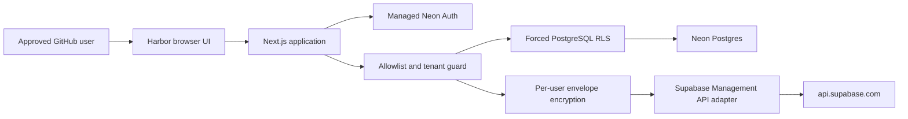

# Supabase Harbor

[](https://github.com/krishna0605/supabase-harbor/actions/workflows/ci.yml)
[](https://github.com/krishna0605/supabase-harbor/actions/workflows/codeql.yml)
[](LICENSE)
[](.node-version)

A private dashboard for managing multiple authorized Supabase accounts without
switching browser profiles.

Harbor validates Personal Access Tokens through Supabase’s official Management API,
encrypts each token with a per-user key, and caches organization and project metadata
in Neon Postgres. It can also schedule a low-privilege daily database heartbeat for
explicitly enrolled Free Plan projects.

> [!IMPORTANT]
> Phase 5’s hosted-runtime hardening is implemented locally, but the project is
> **not publicly deployed yet**. The reviewed Neon production migration, OAuth
> configuration, staging acceptance, and final Vercel/Railway activation remain
> explicit release gates. Do not expose a development instance to the internet.

Supabase Harbor is unofficial and is not affiliated with, maintained by, or endorsed
by Supabase.

## Highlights

- Managed Neon Auth with GitHub OAuth
- Default-deny admission through a server-side numeric GitHub-ID allowlist
- Forced PostgreSQL Row-Level Security on every Harbor tenant table
- Restricted `harbor_runtime` role with no DDL or `BYPASSRLS`
- One random Data Encryption Key per Harbor user
- AES-256-GCM token encryption bound to both user and Harbor account
- Server-held root key with versioned DEK wrapping
- Multiple independently refreshable Supabase accounts
- Unified project search, filtering, health, and lifecycle status
- Cached data remains available when one account fails
- Paused-project restore with reconciliation and an audit trail
- Durable daily keepalive scheduling, leases, retries, and attempt history
- Low-privilege publishable/legacy anon key validation; privileged keys are rejected
- Short-lived Railway cron worker configuration with no public endpoint
- Durable, privacy-preserving hosted rate limits
- Sanitized worker sweep telemetry and delayed-worker detection
- Host, Origin, Fetch Metadata, CSRF, CSP, and secure-session protections

## Architecture



The browser receives sanitized identity, account, and project metadata. It never
receives Supabase PATs, token ciphertext, Neon credentials, the root key, user DEKs,
Auth cookies, or GitHub provider tokens.

## Scope

Included:

- GitHub sign-in and default-deny admission
- Per-user encrypted PAT storage and tenant isolation
- Account connection, rename, enable, disable, refresh, and Harbor-only removal
- Organization/project caching and service-health checks
- Manual, initial, and visible-tab refresh
- Paused-project restoration and reconciliation
- Refresh and restore activity history
- Current-user Harbor data deletion
- Manual keepalive enrollment SQL and Harbor-only enrollment removal
- Automatic publishable-key discovery with manual fallback
- Daily heartbeats, run-now jobs, disable/enable controls, and worker history

Not operationally active yet:

- Production Vercel/Railway deployment
- Production Neon tenant/keepalive migrations
- Production GitHub OAuth and trusted-domain configuration

Not included:

- Supabase Management OAuth
- SQL execution, database contents, logs, billing, or Supabase Auth users
- Project creation, pause, restart, transfer, or deletion

## Phase status

| Phase                                               | Status                                       |
| --------------------------------------------------- | -------------------------------------------- |
| 0 — Design foundation                               | Complete                                     |
| 1 — Tide-table UI                                   | Complete                                     |
| 2 — Neon Postgres                                   | Complete                                     |
| 3 — Hosted auth, tenant isolation, and secret model | Code complete; production activation pending |
| 4 — Keepalive engine and Railway worker             | Code complete; production migration pending  |
| 5 — Vercel/Railway deployment and hardening         | Code complete locally; activation pending    |

## Requirements

- Windows 10/11 for the provided scripts
- Git
- Node.js 24.x LTS
- PowerShell 5.1+
- A Neon project with Managed Neon Auth enabled
- A GitHub OAuth application configured in Neon Auth

## Configure

```powershell
git clone https://github.com/krishna0605/supabase-harbor.git
Set-Location supabase-harbor
Copy-Item .env.example .env.local
```

Fill `.env.local` with server-only values:

```text
DATABASE_URL=<pooled Neon runtime connection>
DATABASE_URL_UNPOOLED=<direct Neon migration connection>
NEON_AUTH_BASE_URL=<branch-specific Neon Auth URL>
NEON_AUTH_COOKIE_SECRET=<random value, at least 32 characters>
HARBOR_MASTER_KEY=<base64-encoded random 32-byte key>
HARBOR_MASTER_KEY_VERSION=1
HARBOR_ALLOWED_GITHUB_IDS=<comma-separated numeric GitHub IDs>
HARBOR_ORIGIN=http://127.0.0.1:47832
```

Generate a root key without printing it into source files:

```powershell
[Convert]::ToBase64String([Security.Cryptography.RandomNumberGenerator]::GetBytes(32))
```

Store that output only in the deployment secret manager or ignored `.env.local`.
Never commit connection strings, cookie secrets, root keys, PATs, or `.env.local`.

Configure GitHub as the only provider in Neon Auth. Email/password, anonymous login,
magic links, and open registration are outside Harbor’s supported configuration.
The OAuth callback URL must match the URL shown by Neon Auth.

## Install and run locally

```powershell
powershell -ExecutionPolicy Bypass -File .\scripts\setup.ps1
.\harbor.ps1
```

Harbor opens at `http://127.0.0.1:47832`. The local launcher remains useful for
development and private testing. Stop it with `Ctrl+C`.

Local bootstrap may use the Neon owner credential and then transactionally switch
application queries to the restricted role. Hosted production must use separate
pooled TLS login credentials for `harbor_runtime` and `harbor_worker`; the owner
credential is migration-only and must never be configured in Vercel or Railway.

## Connect Supabase

Create a Personal Access Token in Supabase account settings. Prefer the narrowest
available permissions:

- Profile access
- `organizations_read`
- `projects_read`
- `project_admin_read`
- `project_admin_write`
- `api_gateway_keys_read` for automatic publishable-key discovery

Harbor validates profile, organization, and project access before storing an
encrypted token. The PAT is never displayed again. Use disposable credentials for
the first smoke test and never place real credentials in CI, fixtures, issues, or
screenshots.

## Enroll a project for keepalive

Open Harbor’s **Keepalive** page, choose an active project in a Free or unknown-plan
organization, and:

1. Copy the hardened enrollment SQL into that project’s Supabase SQL Editor.
2. Run it yourself; Harbor never executes SQL against your project.
3. Let Harbor discover a publishable key, or enter a publishable/legacy anon key
   manually if the PAT lacks `api_gateway_keys_read`.
4. Wait for the live RPC verification to succeed.

The installed table is not readable by `anon`. Only a no-argument
`public.harbor_ping()` function is executable by `anon`. Harbor rejects
`sb_secret_` and legacy `service_role` credentials.

The heartbeat reduces pause risk; it is not a contractual guarantee that Supabase
will never pause a project and Harbor does not show an authoritative pause deadline.

## Run the worker locally

Set `WORKER_DATABASE_URL` to a pooled TLS connection whose login role may
`SET ROLE harbor_worker`, then run:

```powershell
npm run worker:sweep
```

The process enqueues and claims bounded work, records outcomes, and exits. The
committed `railway.worker.json` typechecks the worker, runs this command every
15 minutes, never restarts it as a long-running service, and requires no public
endpoint. Railway secrets and production cron activation remain gated.

## Security model

Each approved user receives a random DEK. That DEK is wrapped with the server-held
`HARBOR_MASTER_KEY`; each PAT is encrypted independently with a unique nonce and
authenticated user/account context.

This protects a copied database from someone who does not also possess the root key.
It does **not** protect against a compromised hosting account or runtime. An operator
or attacker with both database access and `HARBOR_MASTER_KEY` can decrypt all Harbor
PATs. See the [threat model](docs/threat-model.md) and [security policy](SECURITY.md).

Root-key rotation rewraps user DEKs without re-encrypting every PAT. Configure the new
current key and the prior key/version together, back up Neon, then run
`npm run keys:rotate`. Remove the previous key only after every user vault reports the
new version and a disposable-token smoke test succeeds.

## Development

```powershell
npm ci
npm run dev
npm run lint
npm run typecheck
npm run test
npm run test:integration
npm run test:e2e
npm run build
npm run verify
```

Integration resets require all three guards: `NODE_ENV=test`,
`ALLOW_DATABASE_RESET=1`, and a database named `harbor_test`.

## Documentation

- [Architecture](docs/architecture.md)
- [Hosted authentication](docs/hosted-auth.md)
- [Local development](docs/local-hosting.md)
- [Neon Postgres](docs/neon-postgres.md)
- [Threat model](docs/threat-model.md)
- [Cloud roadmap](docs/cloud-roadmap.md)
- [Supabase API compatibility](docs/supabase-api-compatibility.md)
- [Keepalive worker](docs/keepalive-worker.md)
- [Production deployment runbook](docs/production-deployment.md)

## Contributing

Contributions are welcome. Read [CONTRIBUTING.md](CONTRIBUTING.md), the
[Code of Conduct](CODE_OF_CONDUCT.md), and [Security Policy](SECURITY.md) before
opening a pull request.

## License

Licensed under the [Apache License 2.0](LICENSE).
