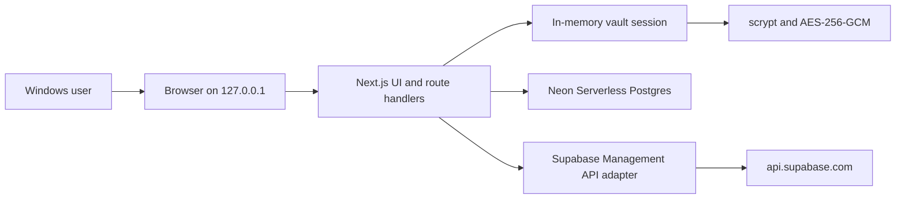

# Supabase Harbor

[](https://github.com/krishna0605/supabase-harbor/actions/workflows/ci.yml)
[](https://github.com/krishna0605/supabase-harbor/actions/workflows/codeql.yml)
[](LICENSE)
[](.node-version)

A private, local-first dashboard for managing multiple authorized Supabase accounts
without switching browser profiles.

Supabase Harbor validates Personal Access Tokens against the official Management API,
encrypts them with a local vault, caches organization and project metadata in Neon
Postgres, and
provides one carefully scoped upstream write operation: restoring a paused project.

> [!IMPORTANT]
> The published `0.1.x` line is the Windows local-first edition with Neon-backed
> persistence. It is **not yet**
> designed for Vercel, Railway, public internet exposure, or multiple Harbor users.
> The planned cloud architecture still requires hosted authentication, Supabase
> OAuth, multi-tenant authorization, and managed key storage.

Supabase Harbor is unofficial and is not affiliated with, maintained by, or endorsed
by Supabase.

## Highlights

- AES-256-GCM envelope encryption for every Supabase PAT
- scrypt-derived master-password protection
- Multiple independently refreshable Supabase accounts
- Unified project search, filtering, health, and lifecycle status
- Cached data remains available when one account fails
- Paused-project restore with status reconciliation and local audit history
- Loopback-only server with Host, Origin, CSRF, CSP, and session protections
- No PATs in browser storage, client bundles, API responses, logs, or plaintext
  PostgreSQL values
- One-command Windows launcher after setup

## Architecture



The browser receives sanitized account and project metadata but never a PAT or
encryption key. Database, cryptography, and Supabase access are server-only.

## Scope

Included:

- Vault setup, unlock, lock, password rotation, and local reset
- Account connection, rename, enable, disable, refresh, and local removal
- Organization and project caching
- Project status normalization and service-health checks
- Manual, initial, and visible-tab refresh
- Paused-project restoration
- Refresh and restore activity history

Deliberately excluded from `0.1.x`:

- Synthetic keepalive traffic
- SQL execution or database contents
- Project creation, pause, restart, transfer, or deletion
- Supabase API keys, Auth users, Storage objects, billing, and logs
- LAN or mobile access
- Hosted multi-user operation

## Requirements

- Windows 10 or 11
- Git
- Node.js 24.x LTS
- PowerShell 5.1 or newer
- A current Chromium, Edge, or Firefox browser
- A Neon project and database

## Install

```powershell
git clone https://github.com/krishna0605/supabase-harbor.git
Set-Location supabase-harbor
Copy-Item .env.example .env.local
# Replace the placeholder DATABASE_URL values in .env.local.
powershell -ExecutionPolicy Bypass -File .\scripts\setup.ps1
```

The setup script:

1. Verifies Windows, Git, and Node.js.
2. Installs the exact dependency lockfile.
3. Runs linting, type checks, tests, and a production build.
4. Applies committed Drizzle migrations through the direct Neon connection.
5. Confirms Neon readiness without overwriting an existing vault.

## Run

```powershell
.\harbor.ps1
```

Harbor opens at `http://127.0.0.1:47832`. Stop it with `Ctrl+C`.

## Connect Supabase

Create a Personal Access Token from your Supabase account settings. When
fine-grained permissions are available, grant only the capabilities Harbor needs:

- Profile access
- `organizations_read`
- `projects_read`
- `project_admin_read`
- `project_admin_write`

Harbor validates profile, organization, and project access before storing an
encrypted token. The PAT is never displayed again.

Use a disposable account or project for the first live smoke test. Never use
production credentials in fixtures, CI, issues, or screenshots.

## Data locations

```text
%LOCALAPPDATA%\SupabaseHarbor\
└─ logs\
   └─ harbor.log
```

Vault envelopes and cached metadata are stored in Neon Postgres. Connection strings
are secrets and belong only in ignored environment files:

```text
DATABASE_URL=<pooled Neon connection>
DATABASE_URL_UNPOOLED=<direct Neon connection>
HARBOR_PORT=47832
HARBOR_LOG_LEVEL=info
```

The host address is intentionally not configurable. Supabase PATs and master
passwords are never accepted through environment variables.

## Security model

Harbor protects stored token envelopes by encrypting PATs at rest. It cannot protect
against malware, administrator-level access, process-memory inspection, or a
compromised browser running under the same Windows account.

The local edition must not be exposed through a tunnel, reverse proxy, container
port, LAN address, or public hosting platform. See the
[threat model](docs/threat-model.md) and [security policy](SECURITY.md).

To report a vulnerability, use GitHub's private vulnerability-reporting flow. Do not
open a public issue containing exploit details or credentials.

## Development

```powershell
npm ci
npm run dev
npm run lint
npm run typecheck
npm run test
npm run test:integration
npm run build
npm run verify
```

The development-only visual route is `/dashboard?preview=1`. Its representative data
is never returned by a production API.

## Documentation

- [Product context](PRODUCT.md)
- [Design direction](DESIGN.md)
- [Architecture](docs/architecture.md)
- [Local hosting](docs/local-hosting.md)
- [Neon Postgres](docs/neon-postgres.md)
- [Threat model](docs/threat-model.md)
- [Supabase API compatibility](docs/supabase-api-compatibility.md)

## Roadmap

- Live Supabase smoke-test fixtures and compatibility reporting
- Encrypted vault export and import
- Optional desktop packaging
- Cloud edition with hosted authentication and tenant isolation
- Supabase Management OAuth with PKCE
- Railway API/worker and Vercel frontend deployment

Cloud support will not reuse the local master-password security boundary.
See [the cloud roadmap](docs/cloud-roadmap.md).

## Contributing

Contributions are welcome. Read [CONTRIBUTING.md](CONTRIBUTING.md) and the
[Code of Conduct](CODE_OF_CONDUCT.md) before opening a pull request.

## License

Licensed under the [Apache License 2.0](LICENSE).
