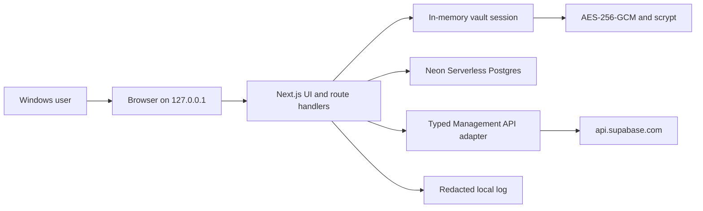

# Architecture

Browser code receives sanitized account and project metadata but never a PAT, master
password, KEK, or DEK. Route handlers are the only layer allowed to access Neon and
the Supabase adapter. Business behavior lives in `src/features`; HTTP and persistence
details remain under `src/server`.

The server renders cached data immediately and refreshes enabled accounts with a
maximum concurrency of three. Every account cache updates transactionally. A failed
refresh preserves prior project rows and records an error code instead of deleting
the cache.

Restore requests are never blindly retried. An accepted restore creates a local action
and sets the cached project to `RESTORING`; the reconcile route reads the project until
it becomes active or fails.

Neon HTTP is used for request-scoped queries and atomic batches. Runtime traffic uses
the pooled connection string; schema migrations use a direct connection. PostgreSQL
stores encrypted token envelopes and cached metadata, while the decrypted vault key
and authenticated sessions remain in the local Node.js process.

Phase 2 remains a single-user local runtime. It must not be deployed publicly until
hosted authentication, per-user ownership, and a server-held encryption root are
implemented.
