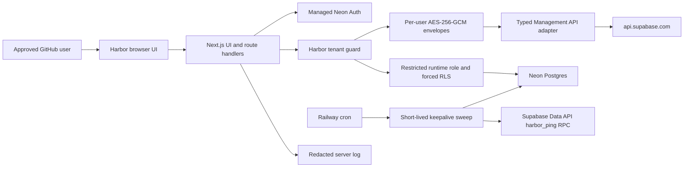

# Architecture

Browser code receives sanitized identity, account, project, health, and activity
metadata. Database credentials, Supabase PATs, PAT ciphertext, root keys, user DEKs,
managed-auth cookies, and GitHub provider tokens remain server-side.

## Request boundary

1. Managed Neon Auth validates its database-backed session.
2. Harbor resolves the linked numeric GitHub provider ID.
3. The server-side allowlist admits or rejects the identity.
4. Only an approved user receives a tenant context.
5. Repository batches switch to `harbor_runtime`, set `harbor.user_id`, and execute
   explicit tenant predicates under forced RLS.
6. Secret operations unwrap the user DEK for one operation and wipe temporary key
   buffers best-effort.

Resource lookups include both the tenant and resource identifier. Cross-tenant IDs
return `404` to avoid confirming that another user’s resource exists.

## Persistence

Neon HTTP is used for request-scoped queries and atomic batches. Runtime traffic uses
the pooled connection; migrations use a direct connection. Every Harbor-owned table
is tenant-owned and protected by forced PostgreSQL RLS.

Account refreshes are bounded to three concurrent accounts. A failed refresh
preserves prior cache rows. Restore POSTs are never blindly retried; accepted actions
are reconciled by subsequent reads.

## Keepalive boundary

Enrollment verifies an explicitly user-installed, no-argument `harbor_ping()` RPC
with a publishable or legacy anon key before committing the encrypted credential,
validation job, and attempt in one tenant transaction. The key is protected with a
separate HKDF subkey and user/account/project authenticated context.

The cron worker has no browser session or public endpoint. Private
`harbor_internal` security-definer functions enqueue, claim, complete, fail, and
clean jobs. Claims use `FOR UPDATE SKIP LOCKED`, unique schedule slots, lease tokens,
and expiring leases. The `harbor_worker` role has no DDL or `BYPASSRLS`.

## Deployment state

Phase 4 supplies the worker artifact and durable scheduler but does not activate a
production Railway service. Public Vercel/Railway topology, production secret
injection, monitoring, rate controls, and deployment verification remain Phase 5.
