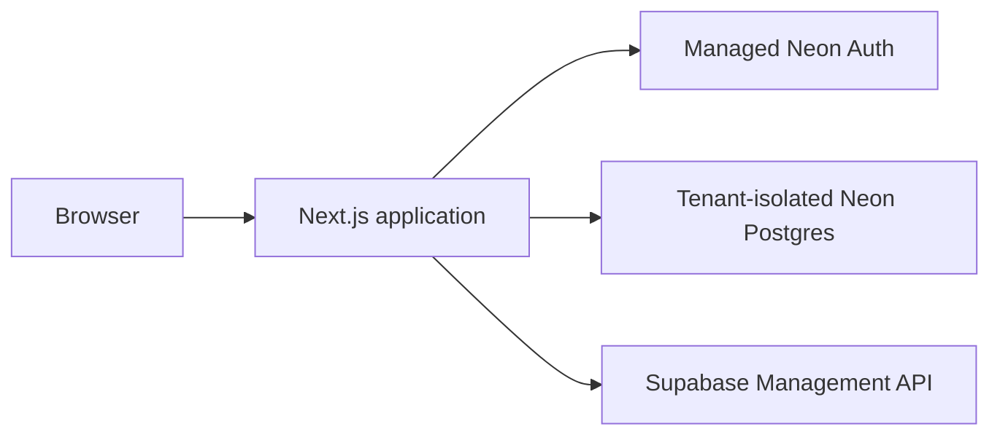

# Cloud roadmap

Phases 3 and 4 completed the hosted identity, tenant, secret, and keepalive worker
implementation. Phase 5’s code hardening is complete locally; production activation
still requires migration approval, staging acceptance, and final promotion.

## Current architecture

## Phase 4 — code complete

- Durable keepalive schedules and job records
- Bounded, leased Railway worker execution
- Per-operation credential decryption
- Retry, deduplication, reconciliation, and audit coverage

## Phase 5 — implementation complete; activation pending

- Serverless-safe structured logging
- Durable HMAC-digested hosted rate limits
- Worker sweep telemetry and delayed-worker status
- Explicit Node.js API runtimes
- Gated Vercel and short-lived Railway configuration
- Hourly production readiness workflow
- Staging/production secret inventory, recovery plan, and deployment runbook

Operational work still pending:

- Approve and apply the reviewed production Neon migrations.
- Configure production/test GitHub OAuth and Neon Auth trusted domains.
- Validate staging with isolated secrets.
- Promote the verified release to production.
- Complete disposable refresh, restore, and keepalive smoke tests.

Follow the [production deployment runbook](production-deployment.md).

Managed KMS and Supabase Management OAuth remain possible post-MVP improvements.
The Phase 3 server-held root key is an explicit operator trust boundary.
