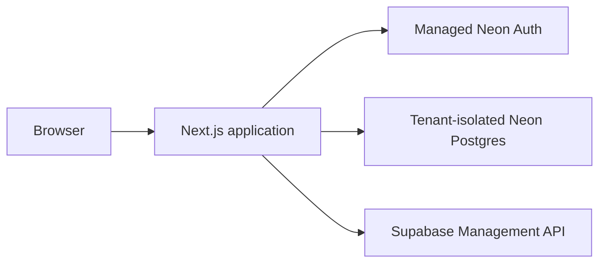

# Cloud roadmap

Phase 3 completed the identity, tenant, RLS, and hosted secret model. It did not
authorize a public deployment.

## Current architecture

## Phase 4

- Add keepalive schedules and durable job records.
- Add a Railway worker with bounded execution and leases.
- Keep token decryption inside one job operation.
- Add retry, deduplication, reconciliation, and worker audit tests.

## Phase 5

- Deploy the Next.js application and API boundary.
- Deploy and isolate the Railway worker.
- Configure production secrets without copying them into source or build output.
- Separate production, test, staging, and preview databases/Auth instances.
- Add rate limiting, monitoring, alerting, backups, recovery drills, and abuse tests.
- Verify secure cookies, HSTS, CSP, Host/Origin policy, and cross-tenant behavior on
  the real public origin.
- Complete a disposable live Supabase restore smoke test.

Managed KMS and Supabase Management OAuth remain possible post-MVP improvements.
The Phase 3 server-held root key is an explicit operator trust boundary.
