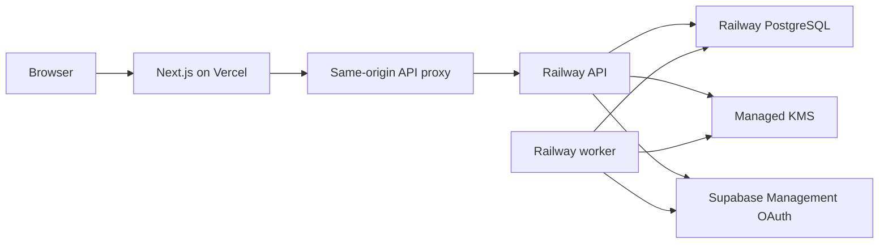

# Cloud roadmap

The local edition cannot be made safe for public hosting by changing only its host
binding. Its SQLite persistence, process-memory vault, and single-user session model
are deliberate local security boundaries.

## Proposed hosted architecture

## Required changes

1. Split browser UI, API, worker, and shared domain packages.
2. Add hosted Harbor authentication with secure database-backed sessions.
3. Replace SQLite with PostgreSQL and add non-null tenant ownership to every row.
4. Replace PAT-first onboarding with Supabase Management OAuth using PKCE and state.
5. Store encrypted access and refresh tokens using envelope encryption and managed
   key wrapping.
6. Add server-side ownership enforcement, database RLS, rate limiting, and audit
   trails.
7. Run refresh and restore reconciliation through durable background jobs.
8. Isolate development, staging, preview, and production environments.
9. Complete cross-tenant, OAuth, key-rotation, recovery, and abuse testing.

Cloud work should be delivered as a separate milestone and threat model. Until that
work is complete, public deployment is unsupported.
